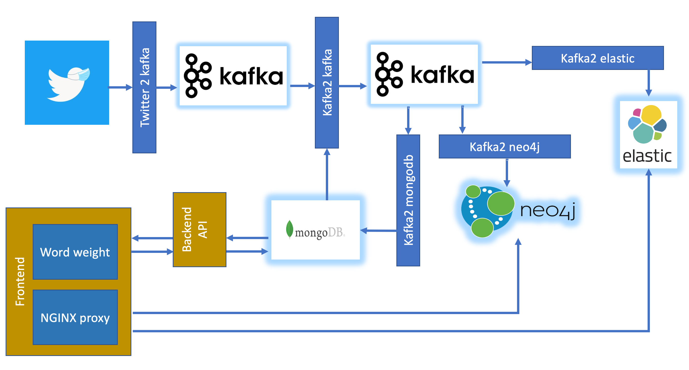

# twitter-analysis

Project to gain some knowledge from docker, machinelearning and other fun stuff

## Introduction

This project is created as an educational project. Main goal is to get acquainted to new technologies.

## Architecture

Main goal is to visualize the trend of sentiment of tweets. As I am a native dutch speaker this is done in the context of the Dutch language.

As you can see in the picture we will try to catch some tweets in kakfa which will act as an buffer to do some processing. Processing consists of two parts. One is splitting tweets in words, saving the words to [MongoDB](https://www.mongodb.com/). Splitting the words is done with help of [Spacy](https://spacy.io/). On top of the MongoDB there is a small angular application where the sentiment of the words can be specified. 
The second part is determining the sentiment of the tweet. Based on the sentiment of words, te sentiment is estimated. There are loads of other (and far better) ways of determining the sentiment of tweets.
The sentiment is reported into an elasticsearch (https://www.elastic.co) cluster and reported in a kibana dashboard. 
Neo4J is introduced as a next step and not actually used at the moment.

## Deployment

All components should be delivered as docker-containers. In order to use a single IP to connect to all endpoints, NGINX (https://www.nginx.com/) is used as a reverse proxy.

